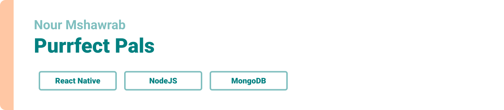

<div align="center">

> Hello world! This is the project’s summary that describes the project plain and simple, limited to the space available. 

**[PROJECT PHILOSOPHY](https://github.com/nour-msh/Purrfect-Pals) • [WIREFRAMES](https://github.com/julescript/well_app#-wireframes) • [TECH STACK](https://github.com/julescript/well_app#-tech-stack) • [IMPLEMENTATION](https://github.com/julescript/well_app#-impplementation) • [HOW TO RUN?](https://github.com/julescript/well_app#-how-to-run)**

</div>

<br><br>


> Purrfect Pals application is an app that links pet owners, pet sitters and veterinarians together. Upon clicking on a request sent by the pet owner or the pet sitter, because each pet owner can be a pet sitter and vice versa, users can access eachothers profiles and communicate.
> 
> Users can communicate through a community chat and can find eachother using the google maps feature.
### User Stories
- As a user, I want to be able to go out without leaving my pet without supervision.
- As a user, I want to be able to find pet owners like me and communicate with them.
- As a user, I want to find veterinarians near by for when my pet is in need of a visit.

<br><br>


> This design was planned before on paper, then moved to Figma app for the fine details.
Note that i didn't use any styling library or theme, all from scratch and using pure css modules

| 
|
|
|
|
|
|
| 
|
|
|
|
|
|


<br><br>


Here's a brief high-level overview of the tech stack the Well app uses:

- This project uses the [React Native framework](https://reactnative.dev/). React native is an open-source JavaScript framework, designed for building apps on multiple platforms like iOS, Android, and also web applications, utilizing the very same code base. It is based on React, and it brings all its glory to mobile app development.
- For persistent storage (database), the app uses the [MongoDB](https://www.mongodb.com/) package which allows storing data in flexible, JSON-like documents, meaning fields can vary from document to document and data structure can be changed over time.
- For the messages, the app uses react-native-gifted-chat which is a great tool for implementing chat in React Native, helping you to improve communication within your application.
- For displaying maps and allowing users to mark their location, the app uses React Native Maps which is a component system for maps that ships with platform-native code that needs to be compiled together with React Native.


<br><br>


> Uing the above mentioned tech stacks and the wireframes built with figma from the user sries we have, the implementation of the app is shown as below, these are screenshots from the real app
||
|
|
|
|
|
|
|
|
|
|


<br><br>


> This is an example of how you may give instructions on setting up your project locally.
To get a local copy up and running follow these simple example steps.
### Prerequisites

This is an example of how to list things you need to use the software and how to install them.
* npm
  ```sh
  npm install npm@latest -g
  ```

### Installation

_Below is an example of how you can instruct your audience on installing and setting up your app. This template doesn't rely on any external dependencies or services._

1. Get a free API Key at [https://example.com](https://example.com)
2. Clone the repo
   ```sh
   git clone https://github.com/your_username_/Project-Name.git
   ```
3. Install NPM packages
   ```sh
   npm install
   ```
4. Enter your API in `config.js`
   ```js
   const API_KEY = 'ENTER YOUR API';
   ```
